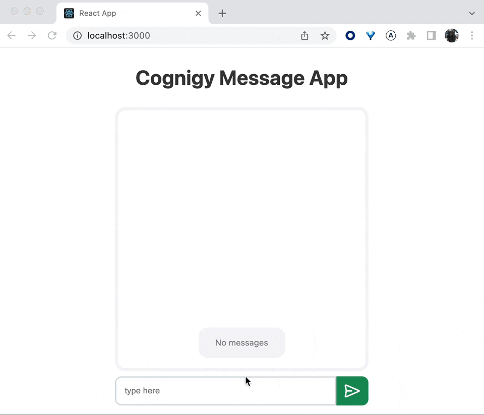

# Cognigy Chat App — Senior Frontend Developer Challenge
> Author: Halil Kayer

## Overview
This project was bootstrapped with [Create React App](https://github.com/facebook/create-react-app) with Typescript
template. For sake of keeping this part as brief as possible, I am going to skip mentioning react, testing-library, 
babel, webpack, eslint and other dependencies comes with `create react app`. `react-redux` and `@reduxjs/toolkit` 
is used for state management. CSS-Modules is my preference for styling, I borrow some styles from [chota](https://jenil.github.io/chota/#features)
in the `index.css`. Additionally, I used prettier for formatting. `npm` is used for package manager so the 
`commands` section suggest `npm` instead of `yarn`. This repo is using `node.js` `v.18.x` and it's specified in the
`package.json`. So if you attempt to run lower version you will receive warning/error on your commmand line tool.

 
## Available Scripts

I will leave this part as is, since Create React app created decent explanation for the command in the `package.json`
except, I will add two additional commands, one for formatting with `prettier` and other one is debugging tests.
details are below:

### `npm start`

Runs the app in the development mode.\
Open [http://localhost:3000](http://localhost:3000) to view it in the browser.

The page will reload if you make edits.\
You will also see any lint errors in the console.

### `npm test`

Launches the test runner in the interactive watch mode.\
See the section about [running tests](https://facebook.github.io/create-react-app/docs/running-tests) for more information.

### `npm run test:debug`

Launces the test runner with debugger attached. So you head over your chromium based browser and 
type address bar `chrome://inspect` (this command can be changed other chromium based browsers, this example for Google Chrome)
and it allow you to debug your tests via good ol' developer tools.

### `npm run build`

Builds the app for production to the `build` folder.\
It correctly bundles React in production mode and optimizes the build for the best performance.

The build is minified and the filenames include the hashes.\
Your app is ready to be deployed!

See the section about [deployment](https://facebook.github.io/create-react-app/docs/deployment) for more information.

### `npm run eject`

**Note: this is a one-way operation. Once you `eject`, you can’t go back!**

If you aren’t satisfied with the build tool and configuration choices, you can `eject` at any time. This command will remove the single build dependency from your project.

Instead, it will copy all the configuration files and the transitive dependencies (webpack, Babel, ESLint, etc) right into your project so you have full control over them. All of the commands except `eject` will still work, but they will point to the copied scripts so you can tweak them. At this point you’re on your own.

You don’t have to ever use `eject`. The curated feature set is suitable for small and middle deployments, and you shouldn’t feel obligated to use this feature. However we understand that this tool wouldn’t be useful if you couldn’t customize it when you are ready for it.

### `npm run format`

This command re-format entire `src` directory with `prettier`'s default format settings. It keeps the codebase consistent.

## Approach/Solution

The Challenge came with a few constraints:
— Implementing state management, either `react-redux` and `@reduxjs/toolkit` or `useReducer` hook along with `createContext` with `useContext` hook.
— Initial version of the app implemented, and it is based on create react app.
— `@cognigy/socket-client` has to be used for sending and receiving messages as a backend.
— Auto scrolls to the new messages.

Create React App is good fit for due to the babel transpiling. `@cognigy/socket-client` is a `nodejs` package and has 
CommonJS module support. So webpack/babel transpiles it nicely, therefore we can use it on the browser. 
I gave a shot with `vite` but `@cognigy/socket-client` has no ES Modules export thus it cannot be bundled with `esbuild`.

`@cognigy/socket-client` is a websocket client and is given the dependency. Allow me to interact with a message bot.
Simply returns my messages back to me. I picked `react-redux` and `@reduxjs/toolkit` for state management over a combination
of `useReducer`, `createContext` and `useContext`. Disclaimer for those who are reading this, my experience with `redux`
not so deep. To be honest, I tend to pick homebrew merging of `useReducer` and `context`. So all these thoughts 
lead me reasoning my decision. First factor is how much do I have to write boilerplate code. At first sight,
`@reduxjs/toolkit` and `react-redux` requires more code to setup, `useReducer` and `context` relatively requires less code.
But considering a proper, scalable infra based on `useReducer` and `context` ( I am actually talking about extracting 
these two combination into a custom hook, maintaining data flow from context to reducer and ending up doing reducers all
over again). Second factor is trouble-shooting. I have to find my solution quickly due to the delivery of the challenge.
homebrew merging of `useReducer`, `createContext` and `useContext` falls behind this because it's pretty uncharted
compare to `@reduxjs/toolkit` and `react-redux`. The last factor is testing. I had a bit of taste hook testing and most of
the time, there's no opinionated way to do so. On the otherside, `@reduxjs/toolkit` and `react-redux`  provides proven
techniques as well as docs. So I decided `@reduxjs/toolkit`and `react-redux` because it's more streamlined.
Relying `@reduxjs/toolkit` more than `react-redux` reduces the amount of boilerplate code too.

### API
After I decided for state management, I checked out what `@reduxjs/toolkit` offer for handling API. Not so long, 
I figured `thunk`s are units for API logic. I played with [`createAsyncThunk`](https://redux-toolkit.js.org/api/) 
but soon I realized it wasn't for the job at hand. First of all, My API is actually a web socket, So communication 
happens via events. There's no asyncronous request happening against to web socket. Second reason after create connection
between app and web socket, I had to keep the socket client instance somewhere, and that place definitely must not be store.
We usually do, REST API calls via built-in `fetch` or libraries like `axios`. `fetch` already come with `node.js`/browser
and `axios` is packed and can be imported. We don't have to concern about maintaining their existence throughout the 
code base. We use it, we're done with it. That simple. On the otherside, my web socket client's instance has to stay
as long as app running. So If I created a thunk with `createAsyncThunk` and keep the socket client instance in it, 
it would be very bad decision for the architecture wise. Bottom line is, thunks are not suitable for my needs. 
I had to come up with my own design decision.

First off, my web socket client (`@cognigy/socket-client`) needs endpoint to connect and token to authenticate. They're
already given as environment variables in the `.env` file. I had to add `REACT_APP_` prefixes so create react app can 
include it into bundle and I can use it on source code.

I created a closure, so initialising phase I will get those environment variables and keep them to the parent function. 
Parent functin will return inner function for which socket client instance later. Until then I could keep URL and
Token without loosing it, also allow me to check existence of required environment variables, so I can throw error early
if any of it is missing.

### COMPONENTS
I barely change them, little touch for fixing typings, adding styles and adding tests where it fits.

### MODEL
I created a `model` folder for keeping common types of which used many places.

### STATE MANAGEMENT
I already mentioned the tech that I chose, let me tell you about the structure. I created a `slice` with `createSlice`
of using `@reduxjs/toolkit`. I stiched it to the store afterwards in the `app-store.ts` for testing the store easily.
I followed the suggestions here: https://redux.js.org/usage/writing-tests and create `setupStore`.

### DESIGN/ARCHITECTURE
Let me start of the structure of the `state` for the app. It keeps `messages` from user and from bot as an **INCOMING**
and **OUTGOING** form. Besides, `sessionId` when the socket connection established. They are held in the store. 

`Input` is place where user is able to send message to the message bot. Submit handler both sends messages to the 
message bot and persists into the store as **OUTGOING**.

I created a custom hook called `useMessageBot` for encapsulating the web socket client logic. it accepts callback and
returns web socket client instance.

`useMessageBot` invoked by the consumer component. It lazy loads the web socket client instance and keep it in its
state, so it won't get created between re-renders. It also uses `useEffect` for web socket client to connect and
hooking into `output` and `error` events. `output` event is  When web socket client's messege as an **INCOMING** type.
given callback is invoked with the received **INCOMING** message payload. 

That hook allows me to distribute web socket client across the app.

`App.tsx` encapsulates all the app concerns. Splitting down into smaller parts didn't make sense at this level of the app.
Briefly, It fetches the state from store via redux hooks as well as dispatches updates. Conveying user's messages
to the web socket client and vice versa.

I created web socket's callback with `useCallback` inside `App.tsx` in order to keep thex same callback between re-renders.
I am keeping the session Id for correlation purposes.

I picked a different solution for keeping visible last messages on the message history. Which is based on CSS and `flexbox`
If I may simply explain, reversing the order of the messages in a flex container so new items added top and after reversed
appear at the bottom. So old messages pushed up. I did it one of my other work (https://github.com/Kjaer/Doodle-Chatty-Challenge)
So same use case fits very well here.

### TESTING
All the tests that are provided meant for integration, except api test. I am embracing the idea "**Testing Trophy**"
(https://kentcdodds.com/blog/the-testing-trophy-and-testing-classifications). That's the reason `Input` and `Message`
components have their own tests but `History`  doesn't.

`App` and `useMessageBot` tests are interesting ones. Solution I found there deserves some highlights.
I start testing `useMessageBot` hook first, and started to mock the api I created `api/message-bot.ts`, therefore I was
mocking SocketClient instance with a slight layer of my API code abstraction on top of it. `connect` and `disconnect` 
methods are easy to mock out. But subscribing to events, `output` in my case, is a little tricky.

After playing and thinking a while, I decided to use `node.js`'s `EventEmitter`. So here's my deal:
- I created an instance from `EventEmitter`.
- I used this instance as a base, so I can mimic web socket client's event subscriptions (with `on`, `off`).
- I derived a new object based my `EventEmitter` instance and added other web socket methods, properties that I require to mock.

A use case of returning every messages user send to bot, done nicely with this solution.

## Remarks
- `React.StrictMode` is turned off. because in the DEV mode of the app, it double renders everything, causes unintended requests to the web socket client which ended doubling messages.
- In order to keep newly added environment variables type safe, I used `react-app-env.d.ts` file comes with the create react app.

## Resources
- https://stackoverflow.com/a/60619061/5018572
- https://stackoverflow.com/a/61897567/5018572
- https://dev.to/plasmo/typescript-and-create-react-app-env-136e
- https://www.becomebetterprogrammer.com/typescript-organizing-and-storing-types-and-interfaces/
- https://dmitripavlutin.com/dont-overuse-react-usecallback/
- https://redux-toolkit.js.org
- https://stackoverflow.com/a/70827129/5018572 -> keep the chat history bottom.
- https://stackoverflow.com/a/48042799/5018572
- https://redux.js.org/usage/writing-tests
- https://kentcdodds.com/blog/how-to-test-custom-react-hooks
- https://icongr.am/octicons